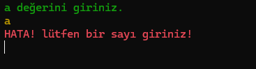
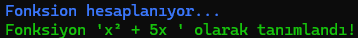

# Fonksiyon Kök Bulucu
İstanbul Kent Üniversitesi Matematik ödevi için yapılmış C# ile programlanmış, ikinci derecen fonksiyonların köklerini hesaplayan bir konsol uygulaması.

## 🧑‍💻 Öğrenci Bilgileri :
- **Ad Soyad :** Osman Yakut
- **Öğrenci Numarası :** 2507020079
- **Bölümü :** Bilgisayar Mühendisliği

## ⚙️ Programın Çalışma Mantığı :
1. **Fonksiyonun Tanımlanması:**
   "ax² + bx + c" formatındaki ikinci dereceden fonksiyonun a, b ve c katsayıları kullanıcıdan alınır.
     
     
3. **Diskriminant Hesaplaması:**
    Tanımlanan fonksiyonun diskriminantı (Δ) yazılım tarafından hesaplanır.
      
    
4. **Diskriminanta Göre Kök Hesaplama**
   - **Δ > 0:** Durumunda *iki adet* reel kökü olduğu
   - **Δ = 0:** Durumunda tek bir *çift katlı* kökü olduğu
   - **Δ < 0:** Durumunda reel bir *kökü olmadığı* belirtilir  
      

## 💻 Programın Bazı Özellikleri :
1. **Girilen değerlerden oluşturulan fonksiyonu konsola görsel olarak yazdırılması**
   - Fonksiyon için girilen a, b ve c değerlerini alarak ekrana yazdırması:  
      
2. **Sayı girilmesi istendiğinde girilen girdinin bir sayı olup olmadığının kontrolü**
   - Eğer sayı yerine başka bir karakter (a, x, y, !, ? vb.) girilirse hata mesajı verilmesi.
      
3. **b veya c değerlerinden herhangi birinin 0 girilmesi durumunda fonksiyon tanımında görsel olarak yer almaması**
   - ***'b'*** değeri 0 ise :  
         
   - ***'c'*** değeri 0 ise :  
      
   
## 📷 Programdan Ekran Görüntüleri
### 1. *"İki tane"* reel kök olduğu bir fonksiyon tanımlandığınında
- ***Örn :*** x² - 5x + 6  
  
### 2. Bir *"Çift Katlı"* reel kök olduğu bir fonksiyon tanımlandığınında
- ***Örn :*** x² - 4x + 4  
  
### 3. Reel bir *"kökü olmayan"* bir fonksiyon tanımlandığınında
- ***Örn :*** 3x² + 4x + 8  
  
