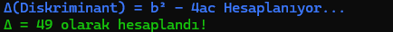
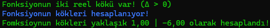
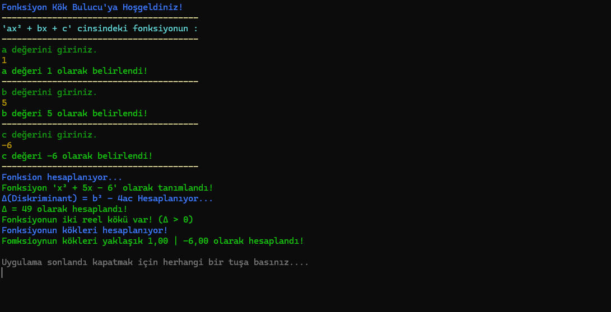

# FonksiyonKokBulucu
İstanbul Kent Üniversitesi Matematik ödevi için yapılmış C# ile programlanmış basit bir kök bulma yazılımı.

## Öğrenci Bilgileri
- **Ad Soyad :** Osman Yakut
- **Öğrenci Numarası :** 2507020079
- **Bölümü :** Bilgisayar Mühendisliği

## Programın çalışma mantığı
- "ax² + bx + c" cinsindeki bir ikinci dereceden fonksiyonun a, b ve c değerleri girildikten sonra yazılım fonksiyonu tanımlar.  
   
- Tanımlanan fonksiyonun diskriminantı (Δ) yazılım tarafından hesaplanır.   
  
- Yazılım; eğer diskriminant (Δ) 0'dan büyükse iki tane kökünü ayrı ayrı hesaplar, 0'a eşitse bir tane olan çift kat kökünü hesaplar ve eğer 0'dan küçükse reel sayılarda kökü yok diye uyarı verir.     
  

## Programdan Ekran Görüntüleri
### *"İki tane"* reel kök olduğu bir fonksiyon tanımlandığınında
***Örn :*** x² - 5x + 6  

### Bir *"Çift Katlı"* reel kök olduğu bir fonksiyon tanımlandığınında
***Örn :*** x² - 4x + 4  

### Reel bir *"kökü olmayan"* bir fonksiyon tanımlandığınında
***Örn :*** x² - 5x + 6  

